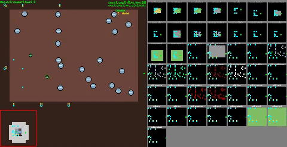

# gym-pysc2

Gym wrapper for pysc2. This repo contains an implementation that honors the gym's API and supports the rendering function. So it is possible to use the `gym.wrappers.Monitor` class to create videos of agents playing the game.




This is still a work in progress but you can see some
example runs here

https://wandb.ai/cleanrl/cleanrl.benchmark/reports/Gym-pysc2-Benchmark--VmlldzoyNTEyMTc


## Installation

```
# First step: install SC2 
## type `iagreetotheeula` to unzip SC2
wget -O ~/sc2.zip http://blzdistsc2-a.akamaihd.net/Linux/SC2.4.10.zip && \
unzip ~/sc2.zip -d ~/ && \
rm ~/sc2.zip

## hack: fix the error message
## ffmpeg: ~/StarCraftII/Libs/libstdc++.so.6: version `GLIBCXX_3.4.26'
## but make sure you have ffmpeg installed
mv ~/StarCraftII/Libs/libstdc++.so.6 ~/StarCraftII/Libs/libstdc++.so.6.temp

# Second step: install pysc2 
git clone https://github.com/vwxyzjn/gym-pysc2
cd gym-pysc2
<!-- pip install gym_pysc2 --upgrade -->

# Optional: construct virtualenv via `pyenv`
pyenv install -s $(sed "s/\/envs.*//" .python-version)
pyenv virtualenv $(sed "s/\/envs\// /" .python-version)
pip install --upgrade pip wheel

# install dependencies for running the training script
pip install -r requirements.txt
```

## Get started

To test installation, run the following code.

```
python3 ppo_sc2.py \
    --gym-id SC2MoveToBeacon-v0 \
    --num-envs 1 \
    --num-steps 256 \
    --cuda True \
    --capture-video
```

Then open another terminal to check tensorboard

```
tensorboard --logdir runs
```

You could also check the videos of agents playing the game
in the `videos` folder

## Run with wandb integration

```
# login wandb by using `wandb login`
for seed in {1..1}
do
    (sleep 0.3 && nohup xvfb-run -a python ppo_sc2.py \
    --total-timesteps 100000000 \
    --gym-id SC2MoveToBeacon-v0 \
    --num-envs 8 \
    --num-steps 256 \
    --wandb-project-name gym_pysc2 \
    --prod-mode \
    --cuda True \
    --capture-video \
    --seed $seed) >& /dev/null &
done
```
